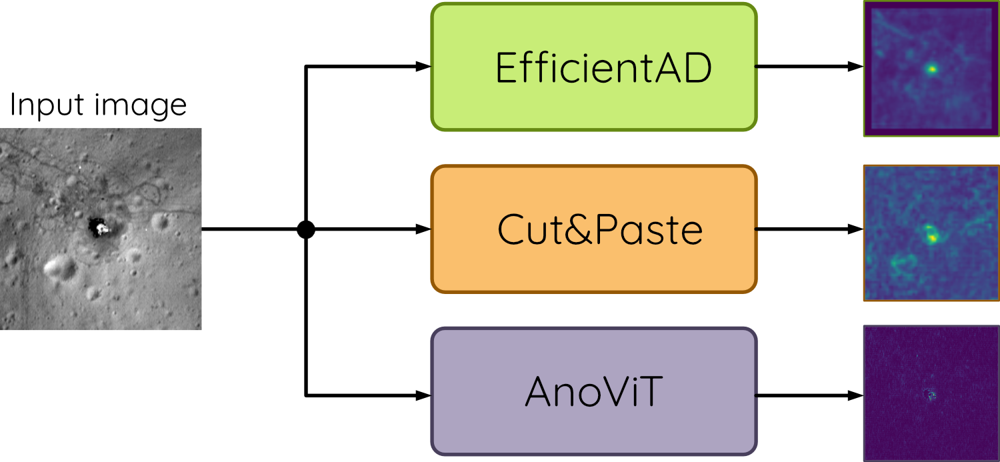

<!-- Improved compatibility of back to top link: See: https://github.com/TechnicToms/lunar-technosignatures/pull/73 -->
<a id="readme-top"></a>
<!--
*** Thanks for checking out the Best-README-Template. If you have a suggestion
*** that would make this better, please fork the repo and create a pull request
*** or simply open an issue with the tag "enhancement".
*** Don't forget to give the project a star!
*** Thanks again! Now go create something AMAZING! :D
-->

<!-- PROJECT SHIELDS -->
[![Contributors][contributors-shield]][contributors-url]
[![Forks][forks-shield]][forks-url]
[![Issues][issues-shield]][issues-url]
[![MIT License][license-shield]][license-url]
[![LinkedIn][linkedin-shield]][linkedin-url]


<!-- PROJECT LOGO -->
<br />
<div align="center">
  <a href="https://github.com/TechnicToms/lunar-technosignatures">
    <picture>
        <source media="(prefers-color-scheme: dark)" srcset="images/darkmode-overview.png">
        
    </picture>
  </a>

  <h3 align="center">Lunar technosignatures</h3>

  <p align="center">
    Repository for corresponding paper: Lunar Technosignatures: A Deep Learning Approach to Detectiong Apollo Landing Sites on the Lunar Surface
    <br />
    <a href="https://github.com/TechnicToms/lunar-technosignatures"><strong>Explore the results »</strong></a>
    <br />
    <br />
    <a href="https://github.com/TechnicToms/lunar-technosignatures">View Paper</a>
    ·
    <a href="https://https://github.com/TechnicToms/lunar-technosignatures/issues/new?labels=bug&template=bug-report---.md">Report Bug</a>
    ·
    <a href="https://github.com/TechnicToms/lunar-technosignatures/issues/new?labels=enhancement&template=feature-request---.md">Request Feature</a>
  </p>
</div>


<!-- TABLE OF CONTENTS -->
<details>
  <summary>Table of Contents</summary>
  <ol>
    <li>
      <a href="#about-the-project">About The Project</a>
      <ul>
        <li><a href="#built-with">Built With</a></li>
      </ul>
    </li>
    <li>
      <a href="#getting-started">Getting Started</a>
      <ul>
        <li><a href="#prerequisites">Prerequisites</a></li>
        <li><a href="#installation">Installation</a></li>
      </ul>
    </li>
    <li><a href="#usage">Usage</a></li>
    <li><a href="#results">Results</a></li>
    <li><a href="#roadmap">Roadmap</a></li>
    <li><a href="#contributing">Contributing</a></li>
    <li><a href="#license">License</a></li>
    <li><a href="#contact">Contact</a></li>
    <li><a href="#acknowledgments">Acknowledgments</a></li>
  </ol>
</details>


<!-- ABOUT THE PROJECT -->
## About The Project
Uncovering anomalies on the lunar surface is crucial for understanding the Moon’s geological and astronomical history. By identifying and studying these anomalies, new theories about the changes that have occurred on the Moon can be developed or refined. This study seeks to enhance anomaly detection on the Moon and replace the time-consuming manual data search process by testing an anomaly detection method using theApollo landing sites. The landing sites are advantageous as they are both anomalous and can be located, enabling an assessment of the procedure. Our study compares the performance of various state-of-the-art machine learning algorithms in detecting anomalies in the Narrow-Angle Camera data from the Lunar Reconnaissance Orbiter spacecraft. The results demonstrate that our approach outperforms previous publications in accurately predicting landing site artifacts and technosignatures at the Apollo 15 and 17 landing sites. While our method achieves promising results, there is still room for improvement. Future refinements could focuson detecting more subtle anomalies, such as the rover tracks left by the Apollo missions.

<p align="right">(<a href="#readme-top">back to top</a>)</p>


### Built With

This project is built in Python and uses PyTorch and Pytorch lightning to train our multimodal model and tokenizers.

* [![Python-lang]][Python-url]
* [![Lightning-framework]][Lightning-url]
* [![PyTorch-framework]][PyTorch-url]

<p align="right">(<a href="#readme-top">back to top</a>)</p>


<!-- GETTING STARTED -->
## Getting Started

This is an example of how you may give instructions on setting up your project locally.
To get a local copy up and running follow these simple example steps.

### Prerequisites
#### Python Environment
To run the Python scripts, you need a Python environment that supports at least version 3.12. The scripts were written in Python version 3.12.3. 

#### Data Structures
The following NAC images are also required to carry out the experiments: 

| Landing site: | Image ID:     | Incidence Angle:  | Phase Angle:  | Nominal Resolution:     |
|---------------|---------------|-------------------|---------------|-------------------------|
| Apollo 15     | M175252641LR  | 49.39°            | 49.64°        | 0.406 m                 |
| Apollo 17     | M113758461R   | 55.72°            | 70.19°        | 0.515 m                 |

To load these images into the program, the NAC images are divided into smaller sub-images and stored in their respective data folders. The script follows the structure below:
<ul>
  <li>Chosen data root</li>
  <ul>
    <li>LRO</li>
    <ul>
      <li>NAC</li>
      <ul>
        <li>Apollo [VERSION] </li>
      </ul>
    </ul>
  </ul>
</ul>
Replace the placeholder [VERSION] with the corresponding number of the landing site, which can be either 15 or 17. Place the tiff image into the corresponding directory and use an image processing program to cut the images in the following way:

- Apollo 15 Landing site
  | Filename:           | x     | y     | w     | h     |
  |---------------------|-------|-------|-------|-------|
  | M175252641_cut1.png | 0     | 0     | 7399  | 14662 |
  | M175252641_cut2.png | 0     | 14662 | 7399  | 14662 |
  | M175252641_cut3.png | 0     | 29324 | 7399  | 14662 |
  | M175252641_cut4.png | 0     | 43986 | 7399  | 14662 |
  | M175252641_cut5.png | 0     | 58648 | 7399  | 14662 |
- Apollo 17 Landing site
  | Filename:           | x     | y     | w     | h     |
  |---------------------|-------|-------|-------|-------|
  | M113758461_cut1.png | 0     | 0     | 10118 | 10450 |
  | M113758461_cut2.png | 0     | 10450 | 10118 | 10450 |
  | M113758461_cut3.png | 0     | 20900 | 10118 | 10450 |
  | M113758461_cut4.png | 0     | 31350 | 10118 | 10450 |
  | M113758461_cut5.png | 0     | 41800 | 10118 | 10450 |

Afterwards, place the ground truths from the `GroundTruths` folder into the appropriate data folder as listed above.


### Installation

1. Install required packages in your environment of choice:
   ```sh
   pip install -r requirements.txt
   ```
2. Clone the repo
   ```sh
   git clone https://github.com/technictoms/lunar-technosignatures.git
   ```

<p align="right">(<a href="#readme-top">back to top</a>)</p>


<!-- USAGE EXAMPLES -->
## Usage

Use this space to show useful examples of how a project can be used. Additional screenshots, code examples and demos work well in this space. You may also link to more resources.

_For more examples, please refer to the [Documentation](https://example.com)_

<p align="right">(<a href="#readme-top">back to top</a>)</p>


## Results
In the following table are the results displayed:
<table><thead>
  <tr>
    <th>Method:</th>
    <th colspan="6" style="text-align:center;">Metrics:</th>
  </tr></thead>
<tbody>
  <tr>
    <td></td>
    <td>Accuracy:</td>
    <td>Precision:</td>
    <td>Recall:</td>
    <td>AUC:</td>
    <td>PaTR:</td>
    <td>AP:</td>
  </tr>
  <tr>
    <td></td>
    <td colspan="6" style="text-align:center;font-weight:bold;">Apollo 15</td>
  </tr>
  <tr>
    <td>AnoViT</td>
    <td>0.9821</td>
    <td>0.9226</td>
    <td>0.9675</td>
    <td>0.9874</td>
    <td>0.3396</td>
    <td>0.8978</td>
  </tr>
  <tr>
    <td>Cut&amp;Paste</td>
    <td>0.8093</td>
    <td>0.4360</td>
    <td>0.7149</td>
    <td>0.8400</td>
    <td>0.1575</td>
    <td>0.3566</td>
  </tr>
  <tr>
    <td>EfficientAD</td>
    <td>0.9125</td>
    <td>0.7395</td>
    <td>0.8765</td>
    <td>0.9461</td>
    <td>0.4736</td>
    <td>0.6855</td>
  </tr>
  <tr>
    <td></td>
    <td colspan="6" style="text-align:center;font-weight:bold;">Apollo 17</td>
  </tr>
  <tr>
    <td>AnoViT</td>
    <td>0.9091</td>
    <td>0.6241</td>
    <td>0.9666</td>
    <td>0.9329</td>
    <td>0.3020</td>
    <td>0.6082</td>
  </tr>
  <tr>
    <td>Cut&amp;Paste</td>
    <td>0.8615</td>
    <td>0.5669</td>
    <td>0.2670</td>
    <td>0.8489</td>
    <td>0.1694</td>
    <td>0.2596</td>
  </tr>
  <tr>
    <td>EfficientAD</td>
    <td>0.8922</td>
    <td>0.6818</td>
    <td>0.9067</td>
    <td>0.9035</td>
    <td>0.4399</td>
    <td>0.6226</td>
  </tr>
</tbody></table>

<p align="right">(<a href="#readme-top">back to top</a>)</p>

<!-- ROADMAP -->
## Roadmap

- [x] Add Changelog
- [x] Add back to top links
- [ ] Add Additional Templates w/ Examples
- [ ] Add "components" document to easily copy & paste sections of the readme
- [ ] Multi-language Support
    - [ ] Chinese
    - [ ] Spanish

See the [open issues](https://github.com/TechnicToms/lunar-technosignatures/issues) for a full list of proposed features (and known issues).

<p align="right">(<a href="#readme-top">back to top</a>)</p>


<!-- CONTRIBUTING -->
## Contributing

Contributions are what make the open source community such an amazing place to learn, inspire, and create. Any contributions you make are **greatly appreciated**.

If you have a suggestion that would make this better, please fork the repo and create a pull request. You can also simply open an issue with the tag "enhancement".
Don't forget to give the project a star! Thanks again!

1. Fork the Project
2. Create your Feature Branch (`git checkout -b feature/AmazingFeature`)
3. Commit your Changes (`git commit -m 'Add some AmazingFeature'`)
4. Push to the Branch (`git push origin feature/AmazingFeature`)
5. Open a Pull Request

### Top contributors:

<a href="https://github.com/TechnicToms/lunar-technosignatures/graphs/contributors">
  
</a>

<p align="right">(<a href="#readme-top">back to top</a>)</p>


<!-- LICENSE -->
## License

Distributed under the MIT License. See `LICENSE.txt` for more information.

<p align="right">(<a href="#readme-top">back to top</a>)</p>


<!-- CONTACT -->
## Contact

Your Name - [@ResearchGate](https://www.researchgate.net/profile/Tom-Sander-4) - tom.sander@tu-dortmund.de

Project Link: [https://github.com/TechnicToms/lunar-technosignatures](https://github.com/TechnicToms/lunar-technosignatures)

<p align="right">(<a href="#readme-top">back to top</a>)</p>


<!-- ACKNOWLEDGMENTS -->
## Acknowledgments

Use this space to list resources you find helpful and would like to give credit to. I've included a few of my favorites to kick things off!

* [Choose an Open Source License](https://choosealicense.com)
* [GitHub Emoji Cheat Sheet](https://www.webpagefx.com/tools/emoji-cheat-sheet)
* [Malven's Flexbox Cheatsheet](https://flexbox.malven.co/)
* [Malven's Grid Cheatsheet](https://grid.malven.co/)
* [Img Shields](https://shields.io)
* [GitHub Pages](https://pages.github.com)
* [Font Awesome](https://fontawesome.com)
* [React Icons](https://react-icons.github.io/react-icons/search)

<p align="right">(<a href="#readme-top">back to top</a>)</p>


<!-- MARKDOWN LINKS & IMAGES -->
<!-- https://www.markdownguide.org/basic-syntax/#reference-style-links -->
[contributors-shield]: https://img.shields.io/github/contributors/TechnicToms/lunar-technosignatures.svg?style=for-the-badge
[contributors-url]: https://github.com/TechnicToms/lunar-technosignatures/graphs/contributors
[forks-shield]: https://img.shields.io/github/forks/TechnicToms/lunar-technosignatures.svg?style=for-the-badge
[forks-url]: https://github.com/TechnicToms/lunar-technosignatures/network/members
[stars-shield]: https://img.shields.io/github/stars/TechnicToms/lunar-technosignatures.svg?style=for-the-badge
[stars-url]: https://github.com/TechnicToms/lunar-technosignatures/stargazers
[issues-shield]: https://img.shields.io/github/issues/TechnicToms/lunar-technosignatures.svg?style=for-the-badge
[issues-url]: https://github.com/TechnicToms/lunar-technosignatures/issues
[license-shield]: https://img.shields.io/github/license/TechnicToms/lunar-technosignatures.svg?style=for-the-badge
[license-url]: https://github.com/TechnicToms/lunar-technosignatures/blob/master/LICENSE.txt
[linkedin-shield]: https://img.shields.io/badge/-LinkedIn-black.svg?style=for-the-badge&logo=linkedin&colorB=555
[linkedin-url]: https://www.linkedin.com/in/tom-sander-54374a20a/

[Python-lang]: https://img.shields.io/badge/Language-Python-2D618C?style=for-the-badge
[Python-url]: https://www.python.org/
[Lightning-framework]: https://img.shields.io/badge/Framework-Lightning-6019cb?style=for-the-badge
[Lightning-url]: https://lightning.ai/docs/pytorch/stable/
[PyTorch-framework]: https://img.shields.io/badge/Framework-PyTorch-ee4c2c?style=for-the-badge
[PyTorch-url]: https://pytorch.org/